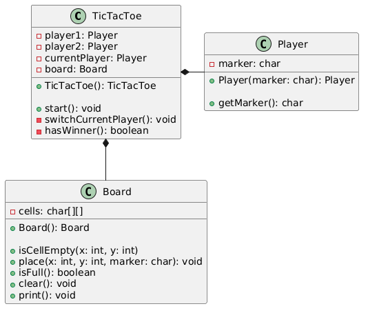

# TicTacToe

This is a TicTacToe game for the FHTW Software Lifecylcle Tooling project

## User Stories

- As a player, I want to be able to make a move by choosing an empty square, so that I can place my symbol on the board.
- As a player, I want to be able to see the current state of the game, so that I can keep track of the moves made by both myself and my opponent.
- As a player, I want to be notified when the game has ended in a win, loss or draw, so that I can see the result of the game.
- As a player, I want to be able to start a new game after the current game has ended, so that I can play again.

## Class Diagram



## Build & Run

All commands run from the `tictactoe/` directory. Requires Java 17 and Maven.

| Command | Action |
|---|---|
| `mvn clean compile` | Compile the project |
| `mvn clean test` | Run all tests |
| `mvn clean package` | Build JAR (`target/tictactoe-1.0-SNAPSHOT.jar`) |
| `java -jar target/tictactoe-1.0-SNAPSHOT.jar` | Run the game |

## Human vs AI Play

The game supports two modes:

### Interactive mode (two human players)
Run without arguments for a shared-terminal two-player game:
```
java -jar target/tictactoe-1.0-SNAPSHOT.jar
```

### CLI mode (human vs AI)
State is stored in `game_state.json`. The AI and human take turns by running CLI commands. The AI plays as **X**, the human plays as **O**.

**Commands (run from `tictactoe/`):**

| Command | Action |
|---|---|
| `java -jar target/tictactoe-1.0-SNAPSHOT.jar new` | Start a new game (X starts) |
| `java -jar target/tictactoe-1.0-SNAPSHOT.jar state` | Show board, current player, and status |
| `java -jar target/tictactoe-1.0-SNAPSHOT.jar valid-moves` | List empty cells |
| `java -jar target/tictactoe-1.0-SNAPSHOT.jar move <row> <col>` | Place your marker at (`row`, `col`) |

**Session flow:**

1. AI runs `java -jar ... new` to start the game
2. AI runs `java -jar ... state` and prompts the human for a move
3. Human runs `java -jar ... move <row> <col>` in their terminal
4. AI checks the state, makes its move with `java -jar ... move <row> <col>`
5. Repeat until the status shows a winner or draw

The AI never makes a human's move — each player runs `move` for themselves.

## Example Output

```
Current Player: X
▁▁▁▁▁▁
| | | |
| | | |
| | | |
▔▔▔▔
row (0-2): 1 (human input)
column (0-2): 1 (human input)
Current Player: O
▁▁▁▁▁▁
| | | |
| |X| |
| | | |
▔▔▔▔
rom (0-2): 1 (human input)
column (0-2): 0 (human input)
Current Player: X
▁▁▁▁▁▁
| | | |
|O|X| |
| | | |
▔▔▔▔
```